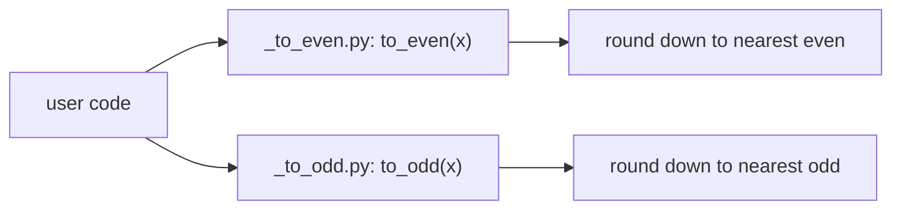

# scitex-math

<p align="center">
  <a href="https://scitex.ai">
    
  </a>
</p>

<p align="center"><b>Mathematical utilities for the SciTeX ecosystem — parity helpers and friends.</b></p>

<p align="center">
  <a href="https://scitex-math.readthedocs.io/">Full Documentation</a> · <code>uv pip install scitex-math[all]</code>
</p>

<!-- scitex-badges:start -->
<p align="center">
  <a href="https://pypi.org/project/scitex-math/"></a>
  <a href="https://pypi.org/project/scitex-math/"></a>
  <a href="https://scitex-math.readthedocs.io/en/latest/"></a>
  <a href="https://www.gnu.org/licenses/agpl-3.0"></a>
</p>
<p align="center">
  <a href="https://github.com/ywatanabe1989/scitex-math/actions/workflows/ci.yml"></a>
  <a href="https://codecov.io/gh/ywatanabe1989/scitex-math"></a>
</p>
<!-- scitex-badges:end -->

---

## Quick Start

```python
from scitex_math import to_even, to_odd

to_even(5)    # 4
to_even(6)    # 6
to_even(3.7)  # 2
to_even(-2.3) # -4

to_odd(6)     # 5
to_odd(7)     # 7
to_odd(5.8)   # 5
```

## Installation

```bash
uv pip install "scitex-math[all]"
```

Through the umbrella: `uv pip install "scitex[math]"`. Requires Python ≥ 3.10.

<details>
<summary><b>Per-extra installs</b></summary>

<br>

| Extra | Pulls in |
|---|---|
| `dev` | `numpy`, `pytest`, `pytest-cov`, `ruff`, `scitex-dev` |
| `docs` | `sphinx`, `sphinx-rtd-theme`, `myst-parser`, `sphinx-copybutton`, `sphinx-autodoc-typehints` |

</details>

## Architecture



<p align="center"><sub><b>Figure 1.</b> Two pure functions, one rule each: round the input down to the nearest integer of the requested parity.</sub></p>

Pure-stdlib core — zero runtime deps.

## 2 Interfaces

scitex-math ships **two** public interfaces, both pure-stdlib:

| Interface | Export | Purpose |
|---|---|---|
| Python API | `from scitex_math import to_even, to_odd` | round-down-to-nearest-parity helpers used directly in scientific code |
| Console script | _(none)_ | scitex-math is a library — no CLI surface; reach for `scitex-math` through the Python import path or the SciTeX umbrella |

<p align="center"><sub><b>Table 1.</b> Interface inventory: the Python API is the whole surface; there is deliberately no console script.</sub></p>

The library deliberately has no CLI, no MCP server, no Skill leaf, and
no peer extras. Adding any of those would create surface area that
isn't needed for the round-down semantics this package owns.

## Status

Standalone module split out of `scitex-gen`. Same semantics as the
original `scitex_gen.to_even` / `scitex_gen.to_odd` — those exports
have been removed from `scitex-gen`; import from `scitex_math` instead.

## Part of SciTeX

> `scitex-math` is part of [**SciTeX**](https://scitex.ai). Install via
> the umbrella with `pip install scitex[math]` to use as
> `scitex.math` (Python) or `scitex math ...` (CLI).

>Four Freedoms for Research
>
>0. The freedom to **run** your research anywhere — your machine, your terms.
>1. The freedom to **study** how every step works — from raw data to final manuscript.
>2. The freedom to **redistribute** your workflows, not just your papers.
>3. The freedom to **modify** any module and share improvements with the community.
>
>AGPL-3.0 — because we believe research infrastructure deserves the same freedoms as the software it runs on.

## License

AGPL-3.0-only (see [LICENSE](./LICENSE)).

---

<p align="center">
  <a href="https://scitex.ai" target="_blank"></a>
</p>
